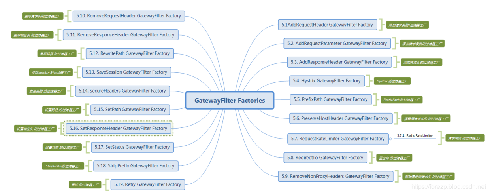

# Getting Started

### Reference Documentation
For further reference, please consider the following sections:

* [Official Apache Maven documentation](https://maven.apache.org/guides/index.html)

### Guides
The following guides illustrate how to use some features concretely:

* [Using Spring Cloud Gateway](https://github.com/spring-cloud-samples/spring-cloud-gateway-sample)
##  Spring Cloud gateway工作流程
在之前的文章的Spring Cloud Gateway初体验中，大家已经对
Spring Cloud Gateway的功能有一个初步的认识，网关作为一个系统的流量的入口，
有着举足轻重的作用，通常的作用如下：
协议转换，路由转发
流量聚合，对流量进行监控，日志输出
作为整个系统的前端工程，对流量进行控制，有限流的作用
作为系统的前端边界，外部流量只能通过网关才能访问系统
可以在网关层做权限的判断
可以在网关层做缓存
Spring Cloud Gateway作为Spring Cloud框架的第二代网关，在功能上要比Zuul更加的强大，
性能也更好。随着Spring Cloud的版本迭代，Spring Cloud官方有打算弃用Zuul的意思。
在笔者调用了Spring Cloud Gateway的使用和功能上，
Spring Cloud Gateway替换掉Zuul的成本上是非常低的，
几乎可以无缝切换。Spring Cloud Gateway几乎包含了zuul的所有功能。

如上图所示，客户端向Spring Cloud Gateway发出请求。 
如果Gateway Handler Mapping确定请求与路由匹配（这个时候就用到predicate），则将其发送到Gateway web handler处理。 Gateway web handler处理请求时会经过一系列的过滤器链。 过滤器链被虚线划分的原因是过滤器链可以在发送代理请求之前或之后执行过滤逻辑。 先执行所有“pre”过滤器逻辑，然后进行代理请求。 在发出代理请求之后，收到代理服务的响应之后执行“post”过滤器逻辑。这跟zuul的处理过程很类似。在执行所有“pre”过滤器逻辑时，往往进行了鉴权、限流、日志输出等功能，以及请求头的更改、协议的转换；转发之后收到响应之后，会执行所有“post”过滤器的逻辑，
在这里可以响应数据进行了修改，比如响应头、协议的转换等。
在上面的处理过程中，有一个重要的点就是讲请求和路由进行匹配，
这时候就需要用到predicate，它是决定了一个请求走哪一个路由。

# Predict
Predicate来自于java8的接口。Predicate 接受一个输入参数，
返回一个布尔值结果。
该接口包含多种默认方法来将Predicate组合成其他复杂的逻辑（比如：与，或，非）。
可以用于接口请求参数校验、判断新老数据是否有变化需要进行更新操作。
add–与、or–或、negate–非。

## After Route Predicate Factory
AfterRoutePredicateFactory，可配置一个时间，当请求的时间在配置时间之后，
才交给 router去处理。否则则报错，不通过路由。
在工程的application.yml配置如下：**after_route**
在上面的配置文件中，配置了服务的端口为8081，
配置spring.profiles.active:after_route指定了程序的spring的启动文件为after_route文件。
在application.yml再建一个配置文件，语法是三个横线，在此配置文件中通过spring.profiles来配置文件名，和spring.profiles.active一致，然后配置spring cloud gateway 相关的配置，
id标签配置的是router的id，每个router都需要一个唯一的id，uri配置的是将请求路由到哪里，本案例全部路由到http://httpbin.org:80/get。
predicates：
After=2017-01-20T17:42:47.789-07:00[America/Denver] 会被解析成PredicateDefinition对象 （name =After ，args= 2017-01-20T17:42:47.789-07:00[America/Denver]）。在这里需要注意的是predicates的After这个配置，遵循的契约大于配置的思想，它实际被AfterRoutePredicateFactory这个类所处理，
这个After就是指定了它的Gateway web handler类为AfterRoutePredicateFactory，同理，其他类型的predicate也遵循这个规则。
当请求的时间在这个配置的时间之后，请求会被路由到http://httpbin.org:80/get。
启动工程，在浏览器上访问http://localhost:8081/，会显示http://httpbin.org:80/get返回的结果，
此时gateway路由到了配置的uri。如果我们将配置的时间设置到当前时之后，浏览器会显示404，此时证明没有路由到配置的uri.

## Header Route Predicate Factory
Header Route Predicate Factory需要2个参数，一个是header名，另外一个header值，该值可以是一个正则表达式。当此断言匹配了请求的header名和值时，断言通过，进入到router的规则中去。
在工程的配置文件加上以下的配置：**header_route**
在上面的配置中，当请求的Header中有X-Request-Id的header名，且header值为数字时，请求会被路由到配置的 uri. 使用curl执行以
执行命令后，会正确的返回请求结果，结果省略。如果在请求中没有带上X-Request-Id的header名，并且值不为数字时，请求就会报404，路由没有被正确转发。

## Cookie Route Predicate Factory
Cookie Route Predicate Factory需要2个参数，一个时cookie名字，另一个时值，可以为正则表达式。它用于匹配请求中，
带有该名称的cookie和cookie匹配正则表达式的请求。
在上面的配置中，请求带有cookie名为
name, cookie值为forezp 的请求将都会转发到uri为 http://httpbin.org:80/get的地址上。
使用curl命令进行请求，在请求中带上 cookie，会返回正确的结果，否则，请求报404错误。

## Host Route Predicate Factory
Host Route Predicate Factory需要一个参数即hostname，它可以使用. * 等去匹配host。这个参数会匹配请求头中的host的值，一致，则请求正确转发。
在工程的配置文件，加上以下配置：**host_route**
在上面的配置中，请求头中含有Host为fangzhipeng.com的请求将会被路由转发转发到配置的uri。 启动工程，执行以下的curl命令，
请求会返回正确的请求结果：curl -H 'Host:www.fangzhipeng.com' localhost:8081

## Method Route Predicate Factory
Method Route Predicate Factory 需要一个参数，即请求的类型。比如GET类型的请求都转发到此路由。
在工程的配置文件加上以下的配置：**method_route**
在上面的配置中，所有的GET类型的请求都会路由转发到配置的uri。使用 curl命令模拟 get类型的请求，会得到正确的返回结果。
curl localhost:8081
使用 curl命令模拟 post请求，则返回404结果。
curl -XPOST localhost:8081

## Path Route Predicate Factory
Path Route Predicate Factory 需要一个参数: 一个spel表达式，应用匹配路径。
在工程的配置文件application.yml文件中，做以下的配置：path_route
在上面的配置中，所有的请求路径满足/foo/{segment}的请求将会匹配并被路由，比如/foo/1 、/foo/bar的请求，将会命中匹配，并成功转发。
使用curl模拟一个请求localhost:8081/foo/dew，执行之后会返回正确的请求结果。
curl localhost:8081/foo/dew

## Query Route Predicate Factory
Query Route Predicate Factory 需要2个参数:一个参数名和一个参数值的正则表达式。
在工程的配置文件application.yml做以下的配置：query_route
在上面的配置文件中，配置了请求中含有参数foo，并且foo的值匹配ba.，则请求命中路由，比如一个请求中含有参数名为foo，值的为bar，能够被正确路由转发。
模拟请求的命令如下：curl localhost:8081?foo=bar
Query Route Predicate Factory也可以只填一个参数，填一个参数时，则只匹配参数名，即请求的参数中含有配置的参数名，则命中路由。比如以下的配置中，配置了请求参数中含有参数名为foo 的参数将会被请求转发到uri为http://httpbin.org:80/get。
spring:
  cloud:
    gateway:
      routes:
      - id: query_route
        uri: http://httpbin.org:80/get
        predicates:
        - Query=foo
  profiles: query_route

# 总结
在本篇文章中，首先介绍了Spring Cloud Gateway的工作流程和原理，
然后介绍了gateway框架内置的predict及其分类，最后以案例的形式重点讲解了几个重要的Predict。
**Predict作为断言，它决定了请求会被路由到哪个router 中**。在断言之后，请求会被进入到filter过滤器的逻辑，
下篇文章将会为大家介绍Spring Cloud Gateway过滤器相关的内容。

# filter
**Predict决定了请求由哪一个路由处理，在路由处理之前，需要经过“pre”类型的过滤器处理，
处理返回响应之后，可以由“post”类型的过滤器处理**。

## filter的作用和生命周期
由filter工作流程点，可以知道filter有着非常重要的作用，
在“pre”类型的过滤器可以做:
参数校验
权限校验
流量监控
日志输出
协议转换等，
在“post”类型的过滤器中可以做：
响应内容
响应头的修改
日志的输出
流量监控等。
首先需要弄清一点为什么需要网关这一层，这就不得不说下filter的作用了。
## 生命周期
Spring Cloud Gateway同zuul类似，有“pre”和“post”两种方式的filter。客户端的请求先经过“pre”类型的filter，然后将请求转发到具体的业务服务，比如上图中的user-service，收到业务服务的响应之后，再经过“post”类型的filter处理，最后返回响应到客户端。

与zuul不同的是，filter除了分为“pre”和“post”两种方式的filter外，
在Spring Cloud Gateway中，filter从作用范围可分为另外两种，
**一种是针对于单个路由的gateway filter，它在配置文件中的写法同predict类似。**
**另外一种是针对于所有路由的global gateway filer。现在从作用范围划分的维度来讲解这两种filter。**

## gateway filter
过滤器允许以某种方式修改传入的HTTP请求或传出的HTTP响应。过滤器可以限定作用在某些特定请求路径上。 Spring Cloud Gateway包含许多内置的GatewayFilter工厂。
GatewayFilter工厂同上一篇介绍的Predicate工厂类似，都是在配置文件application.yml中配置，遵循了约定大于配置的思想，只需要在配置文件配置GatewayFilter Factory的名称，而不需要写全部的类名，比如AddRequestHeaderGatewayFilterFactory只需要在配置文件中写AddRequestHeader，而不是全部类名。在配置文件中配置的GatewayFilter Factory最终都会相应的过滤器工厂类处理。
Spring Cloud Gateway 内置的过滤器工厂一览表如下：

在挑几个常见的过滤器工厂来讲解，每一个过滤器工厂在官方文档都给出了详细的使用案例，
如果不清楚的还可以在org.springframework.cloud.gateway.filter.factory看每一个过滤器工厂的源码。

## 自定义过滤器
Spring Cloud Gateway内置了19种强大的过滤器工厂，能够满足很多场景的需求，那么能不能自定义自己的过滤器呢，
当然是可以的。在spring Cloud Gateway中，**过滤器需要实现GatewayFilter和Ordered2个接口**。写一个RequestTimeFilter

## 自定义过滤器工厂
在上面的自定义过滤器中，有没有办法自定义过滤器工厂类呢?这样就可以在配置文件中配置过滤器了。
现在需要实现一个过滤器工厂，在打印时间的时候，可以设置参数来决定是否打印请参数。查看GatewayFilterFactory的源码，
可以发现GatewayFilterfactory的层级如下：

过滤器工厂的顶级接口是GatewayFilterFactory，
我们可以直接继承它的两个抽象类来简化开发AbstractGatewayFilterFactory和AbstractNameValueGatewayFilterFactory，
这两个抽象类的区别就是前者接收一个参数（像StripPrefix和我们创建的这种），后者接收两个参数（像AddResponseHeader）。

过滤器工厂的顶级接口是GatewayFilterFactory，有2个两个较接近具体实现的抽象类，
分别为AbstractGatewayFilterFactory和AbstractNameValueGatewayFilterFactory，
这2个类前者接收一个参数，比如它的实现类RedirectToGatewayFilterFactory；后者接收2个参数，
比如它的实现类AddRequestHeaderGatewayFilterFactory类。现在需要将请求的日志打印出来，
需要使用一个参数，这时可以参照RedirectToGatewayFilterFactory的写法。

## global filter
Spring Cloud Gateway根据作用范围划分为GatewayFilter和GlobalFilter，二者区别如下：
GatewayFilter : 需要通过spring.cloud.routes.filters 配置在具体路由下，只作用在当前路由上或通过spring.cloud.default-filters配置在全局，作用在所有路由上
GlobalFilter : 全局过滤器，不需要在配置文件中配置，作用在所有的路由上，最终通过GatewayFilterAdapter包装成GatewayFilterChain可识别的过滤器，
它为请求业务以及路由的URI转换为真实业务服务的请求地址的核心过滤器，不需要配置，系统初始化时加载，并作用在每个路由上。
Spring Cloud Gateway框架内置的GlobalFilter如下：

上图中每一个GlobalFilter都作用在每一个router上，能够满足大多数的需求。但是如果遇到业务上的定制，可能需要编写满足自己需求的GlobalFilter。在下面的案例中将讲述如何编写自己GlobalFilter，该GlobalFilter会校验请求中是否包含了请求参数“token”，如何不包含请求参数“token”则不转发路由，否则执行正常的逻辑。代码如下：
在上面的TokenFilter需要实现GlobalFilter和Ordered接口，这和实现GatewayFilter很类似。然后根据ServerWebExchange获取ServerHttpRequest，然后根据ServerHttpRequest中是否含有参数token，如果没有则完成请求，终止转发，否则执行正常的逻辑。
然后需要将TokenFilter在工程的启动类中注入到Spring Ioc容器中，代码如下：

## 总结
本篇文章讲述了Spring Cloud Gateway中的过滤器，包括GatewayFilter和GlobalFilter。
从官方文档的内置过滤器讲起，然后讲解自定义GatewayFilter、GatewayFilterFactory以及自定义的GlobalFilter。
有很多内置的过滤器并没有讲述到，比如限流过滤器，这个我觉得是比较重要和大家关注的过滤器，将在之后的文章讲述。

## Spring Cloud Gateway限流
在高并发的系统中，往往需要在系统中做限流，一方面是为了防止大量的请求使服务器过载，
导致服务不可用，另一方面是为了防止网络攻击。
常见的限流方式，比如Hystrix适用线程池隔离，超过线程池的负载，
走熔断的逻辑。在一般应用服务器中，比如tomcat容器也是通过限制它的线程数来控制并发的；
也有通过时间窗口的平均速度来控制流量。
常见的限流纬度有比如
通过Ip来限流、
通过uri来限流、
通过用户访问频次来限流。
一般限流都是在网关这一层做，比如Nginx、Openresty、kong、zuul、Spring Cloud Gateway等；
也可以在应用层通过Aop这种方式去做限流。

## 常见的限流算法
### 计数器算法
计数器算法采用计数器实现限流有点简单粗暴，
一般我们会限制一秒钟的能够通过的请求数，
比如限流qps为100，算法的实现思路就是从第一个请求进来开始计时，
在接下去的1s内，每来一个请求，就把计数加1，如果累加的数字达到了100，
那么后续的请求就会被全部拒绝。等到1s结束后，把计数恢复成0，重新开始计数。
具体的实现可以是这样的：对于每次服务调用，可以通过AtomicLong#incrementAndGet()方法来给计数器加1并返回最新值，
通过这个最新值和阈值进行比较。这种实现方式，相信大家都知道有一个弊端：
如果我在单位时间1s内的前10ms，已经通过了100个请求，那后面的990ms，
只能眼巴巴的把请求拒绝，我们把这种现象称为“突刺现象”

## 漏桶算法
漏桶算法为了消除"突刺现象"，可以采用漏桶算法实现限流，漏桶算法这个名字就很形象，
算法内部有一个容器，类似生活用到的漏斗，当请求进来时，相当于水倒入漏斗，
然后从下端小口慢慢匀速的流出。不管上面流量多大，下面流出的速度始终保持不变。
不管服务调用方多么不稳定，通过漏桶算法进行限流，每10毫秒处理一次请求。
因为处理的速度是固定的，请求进来的速度是未知的，可能突然进来很多请求，
没来得及处理的请求就先放在桶里，既然是个桶，肯定是有容量上限，如果桶满了，
那么新进来的请求就丢弃。

在算法实现方面，可以准备一个队列，用来保存请求，另外通过一个线程池（ScheduledExecutorService）来定期从队列中获取请求并执行，可以一次性获取多个并发执行。
这种算法，在使用过后也存在弊端：无法应对短时间的突发流量。
 
## 令牌桶算法
从某种意义上讲，令牌桶算法是对漏桶算法的一种改进，桶算法能够限制请求调用的速率，
而令牌桶算法能够在限制调用的平均速率的同时还允许一定程度的突发调用。在令牌桶算法中，
存在一个桶，用来存放固定数量的令牌。算法中存在一种机制，以一定的速率往桶中放令牌。
每次请求调用需要先获取令牌，只有拿到令牌，才有机会继续执行，否则选择选择等待可用的令牌、
或者直接拒绝。放令牌这个动作是持续不断的进行，如果桶中令牌数达到上限，就丢弃令牌，
所以就存在这种情况，桶中一直有大量的可用令牌，这时进来的请求就可以直接拿到令牌执行，
比如设置qps为100，那么限流器初始化完成一秒后，桶中就已经有100个令牌了，这时服务还没完全启动好，
等启动完成对外提供服务时，该限流器可以抵挡瞬时的100个请求。所以，只有桶中没有令牌时，
请求才会进行等待，最后相当于以一定的速率执行。

实现思路：可以准备一个队列，用来保存令牌，另外通过一个线程池定期生成令牌放到队列中，每来一个请求，就从队列中获取一个令牌，并继续执行。

## gateway限流
在Spring Cloud Gateway中，有Filter过滤器，
因此可以在“pre”类型的Filter中自行实现上述三种过滤器。
但是限流作为网关最基本的功能，
Spring Cloud Gateway官方就提供了RequestRateLimiterGatewayFilterFactory这个类，
适用Redis和lua脚本实现了令牌桶的方式。
具体实现逻辑在RequestRateLimiterGatewayFilterFactory类中，
lua脚本在如下图所示的文件夹中：
!][img](doc/20190601125822176.png)
具体源码不打算在这里讲述，读者可以自行查看，代码量较少，
先以案例的形式来讲解如何在Spring Cloud Gateway中使用内置的限流过滤器工厂来实现限流。
