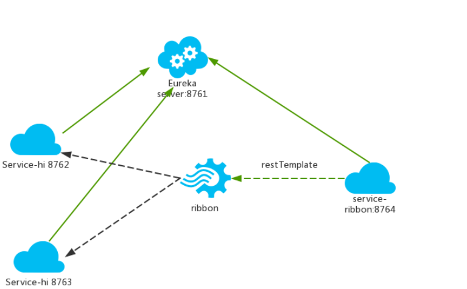

## ribbon简介
在微服务架构中，业务都会被拆分成一个独立的服务，服务与服务的通讯是基于http restful的。Spring cloud有两种服务调用方式，一种是ribbon+restTemplate，另一种是feign。在这一篇文章首先讲解下基于ribbon+rest。
ribbon是一个负载均衡客户端，可以很好的控制htt和tcp的一些行为。Feign默认集成了ribbon。
ribbon 已经默认实现了这些配置bean：
IClientConfig ribbonClientConfig: DefaultClientConfigImpl
IRule ribbonRule: ZoneAvoidanceRule
IPing ribbonPing: NoOpPing
ServerList ribbonServerList: ConfigurationBasedServerList
ServerListFilter ribbonServerListFilter: ZonePreferenceServerListFilter
ILoadBalancer ribbonLoadBalancer: ZoneAwareLoadBalancer

## 架构图

